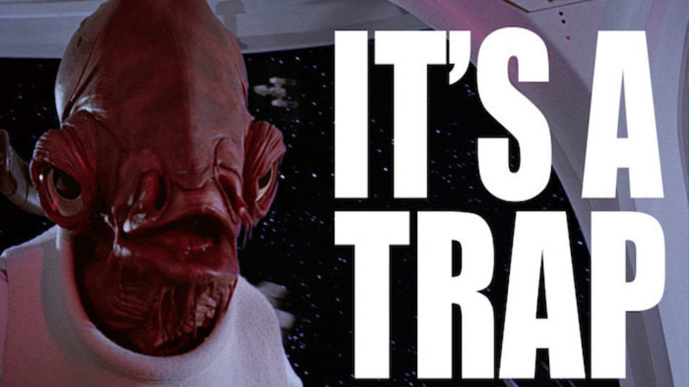

Una riflessione sul ruolo delle trappole in Dungeon World

<!--more-->

## La trappola di Schrodinger

L'altro giorno stavo facendo da GM a Dungeon World, libera e felice come una farfalla.

Ho deciso di introdurre un ambiente sotterraneo che mi piaceva, un corridoio orizzontale con da un lato un baratro largo mezzo metro, ma di 5-6 metri di profondità.

Non avevo particolari idee in proposito, era solo un ambiente che mi piaceva, e non avevo pensato a cosa ci potesse essere dentro.

Quinn, che giocava il Ladro, ha detto "Ok, cerco trappole". Giustamente, è un Ladro. I Ladri cercano trappole. E se ho descritto quell'ambiente ci sarà un motivo, no?

Ecco, la trappola non c'era, fino a quel momento. Perché non avevo pensato che ci potesse essere. Ma in quel momento ci ho pensato, e ho detto "Perché no? Ci sarà una trappola!"

Se Quinn non avesse detto niente, non avrei pensato a mettere la trappola, e a tutti i fatti non ci sarebbe stata! Complimenti Quinn, hai creato una trappola.

## Ok, e quindi?

E quindi la cosa mi ha fatto pensare. È inevitabile che le cose si creino durante il gioco: in qualsiasi momento il GM si può trovare ad inventare, a colmare i vuoti lasciati dalla preparazione. Ma la faccenda delle trappole mi lasciava un sapore strano in bocca. C'era un ingrediente strano che non sapevo identificare.

Ecco il testo della mossa:

> ESPERTO DI TRAPPOLE
> Quando ti prendi un momento per ispezionare un’area pericolosa,
> tira+DES. Con 10+, prendi 3; con 7-9, prendi 1.
> Spendi le tue prese mentre cammini attraverso l’area per avere risposta
> alle seguenti domande:
> • C’è una trappola qui, e se è così cosa la attiva?
> • Cosa fa la trappola, una volta attivata?
> • Cos’altro c’è di nascosto, qui?

Quindi ipotizziamo i vari casi:

| C'è la trappola prima che parli il ladro? | Il Ladro cerca trappole? | C'è la trappola dopo che ha parlato il ladro? |  |
|---|---|---|---|
| NO | NO | NO | Ok, gioco normale |
| NO | NO | SI | Il GM è uno stronzo |
| NO | SI | NO | Sembra un tiro un po' inutile |
| NO | SI | SI | A conti fatti la trappola è stata creata dalla ricerca |
| SI | NO | NO | Uhm, perché stai facendo così GM? Sembra sospetto |
| SI | NO | SI | Occasione su un piatto d'argento. Scatta la trappola |
| SI | SI | NO | Mi stai pigliando per il culo, GM? |
| SI | SI | SI | Ok, ho trovato la trappola |

La cosa si complica ancora di più se si considerano i possibili fallimenti. Cosa succede se non c'è una trappola, il Ladro tira per Cercare una Trappola e fallisce? Urgh.

## A cosa serve una trappola?

Le trappole nascono come sfide. Quando esplorare un dungeon è questione di essere più duri dei duri e più furbi dei furbi, le trappole sono qualcosa che ti mette alla prova. Riuscirai a capire che c'è una trappola dagli indizi che ha lasciato il GM? Riuscirai a trovare il modo di disinnescarla prima che ti costi preziosi punti ferita o addirittura la vita?

Dungeon World però non è proprio così. Non vuole metterti alla prova. Non davvero. Le cose che interessano sono differenti, e in comune con i giochi di esplorazione dungeon ha solo l'estetica.

Per questo invece di usare l'approccio di far capire a chi gioca se c'è una trappola e come disinnescarla, demanda la cosa a un tiro di dado. 

Il problema è che poche interazioni della tabella sopra sembrano davvero interessanti. 

## Come esplorare un Dungeon in Dungeon World

> Il fatto è che in Dungeon World non dovresti fermarti a chiedere 'Cosa Fate' se non c'è niente da fare. Se vuoi far vedere gli ambienti del dungeon ci sta, ma non ti devi fermare. Puoi anche dire quello che fanno i personaggi, se è sensato. Puoi dire per esempio che entrano dalla grossa porta di legno, scendono i gradini umidi della cantina, seguono il cunicolo che porta a una stanza con un tavolo di legno ribaltato, si intrufolano nella crepa nella parete e arrivano in una grande sala buia, dove si intravedono delle grosse sagome appese al soffitto. Potrebbero sembrare dei pipistrelli, se non fosse che sono di dimensioni umane. Cosa fate?
> -Spiegel-

Quando il GM dice "Cosa Fate", è lì che iniziano le scelte che importano davvero. Con questo approccio la mossa di Cercare Trappole ha ancora meno senso. Se ti fermi a chiedere "Cosa Fate" in una stanza dove c'è una trappola, il Ladro non ha molte scelte se non tirare il dado e vedere se trova la trappola.

## Sensi dell'avventuriero

Una possibile soluzione è sostituire la mossa con una molto più semplice:

> SENSI DELL'AVVENTURIERO
> Hai esperienza con trappole e meccanismi e sei sempre all'erta. Il GM ti dirà sempre se ci sono trappole o meccanismi nascosti nei paraggi.

Questo perché la domanda interessante, nel caso di Dungeon World, non è se il Ladro trova o meno la trappola, ma cosa fa dopo averla trovata.

## E se non c'è un ladro nel nostro party?

Vi sucate le trappole, losers.